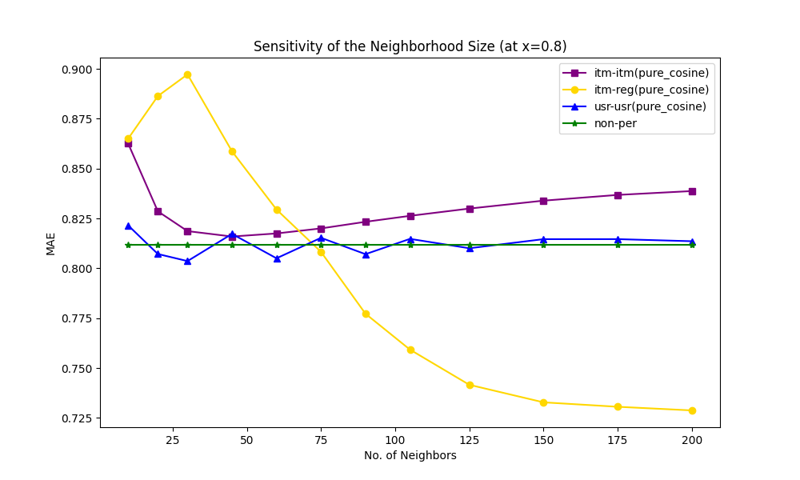

# Recommender System

This project aims to recreate experiments from the paper "Item-Based Collaborative Filtering Recommendation Algorithms" by Badrul Sarwar, George Karypis, Joseph Konstan, and John Riedl.

## Experiment Results

### 1. Performance of different similarity measures

### 2. Sensitivity of train/test ratio on performance

### 3. Sensitivity of neighborhood size
